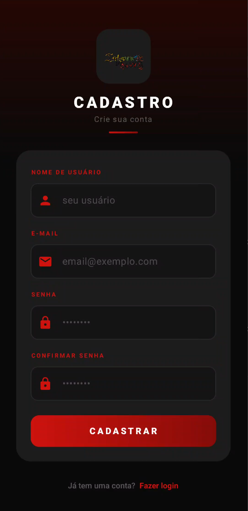
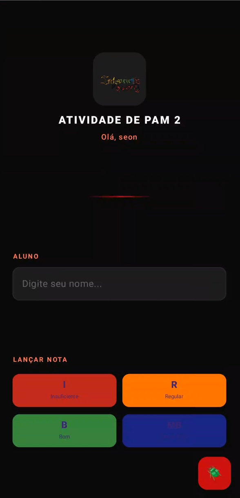
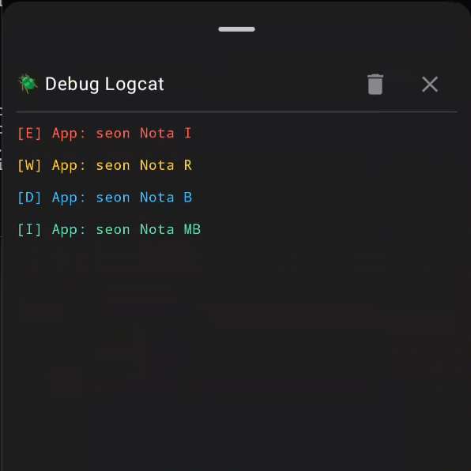

# Logcat
 

## Linguagem utilizada:

## Como usar?
<ul>
  <li>Faça registro e depois login;</li>
  <li>Após isso, coloque o nome de um aluno para avaliar;</li>
  <li>Clique em um dos 4 botões para atribuir uma nota a esse aluno;</li>
  <li>Por fim, para ver as notas atribuidas, clique no botão com um inseto, para acessar o Logcat.</li>
</ul>

## Como rodar o projeto?
<ul>
  <li>Baixe o repositório como um arquivo.zip;</li>
  <li>Extraia ele com alguma ferramenta de extração de arquivos;</li>
  <li>Abra o projeto no Android Studio, preferencialmente a versão mais atual;</li>
  <li>Após fazer importação do aplicativo, aperte Shift+F10, ou o botão de executar.</li>
</ul>

## Telas:
 <table>
  <tr>
    <td></td>
    <td></td>
    <td></td>
    <td></td>
  </tr>
</table> 

## Execução:

